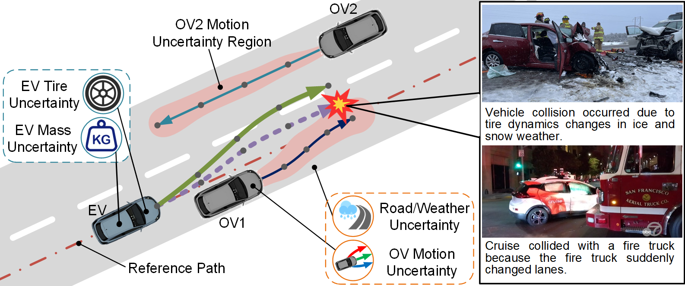
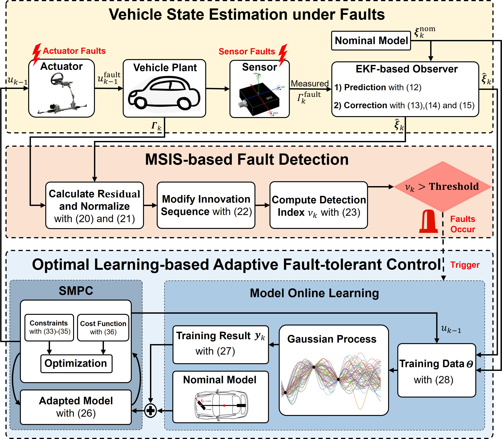

Dr.Guoqiang Li is currently an associate professor in the School of Mechanical Engineering, Beijing Institute of Technology, China. Prior to this, he worked as a research scientist in Singapore-MIT Alliance for Research and Technology (SMART) in Singapore, and was a research engineer in Visteon Electronics Germany GmbH (European Research Center) in Germany. He received the Dr.-Ing. degree in the Department of Electronical and Computer Engineering from the University of Kaiserslautern, Germany. Dr.Li's research interest is at the intersection of optimization, control theory, and machine learning, to build advanced mobility systems, develop effective multi-information fusion algorithms, and design sophisticated motion planning and optimal control techniques for connected automated vehicles/robots and intelligent transportation systems to operate safely, efficiently and intelligently in dynamic uncertain environments. 

**Research Areas**
======
-	AI and ML in Connected Automated Vehicles (CAV)
-	Fault Diagnose and Resilient Control
-	Intelligent Mobility Systems
-	Safety and Security in Autonomous Driving 
-	Optimization and Control
-	Human-centered Assistance Systems
-	Intelligent Transportation System (ITS)
-	Cyber-Physical Systems (CPS)

**Recent Featured Work**
======
- **Meta-learning based Optimal Trajectory Planning under Uncertain Condition**

In the real traffic situation, the complex dynamic environment contains lots of uncertainties, bringing challenges in safe driving. The changes in internal parameters of the ego vehicle, e.g. mass (from passengers, cargo), tire characteristics (from the load, pressure, temperature), lead to modeling mismatches. Moreover, the uncertain motion of obstacle vehicles can lead to unexpected driving behaviors, posing great challenges in safe driving. Targeting this, a novel meta-learning-based trajectory optimization approach for safe autonomous driving is proposed to address the uncertainty of environment and obstacle motion. The method leverages meta-learning for the model online adaption and trajectory optimization for active collision avoidance considering the motion uncertainty of multiple obstacles. It can achieve 100% collision-free for safe driving in complex scenarios involving multiple obstacles under motion uncertainty, providing safety capability for reliable autonomous driving. The test video can be found here. ([Viedo](https://youtu.be/Dx5L-fe4lTo))

	

- **Fault Detection and Data-driven Active Fault-tolerant Control for Autonomous Driving**

In automated vehicles, the growing number of sensors have increased the system complexity, making the vehicles susceptible to faults. The widely applied drive-by-wire technologies have also brought great demand in the system redundancy. When the vehicle suffers from faults on key components, it may lose stability and cause potential danger during driving without timely full control or effective takeover by human drivers. Therefore, real-time fault detection and active fault-tolerant control on vehicles play significant role to effectively prevent potential accidents and ensure safe autonomous driving. To improve the system stability and safety, a novel data-driven optimal adaptive fault-tolerant control method with model learning is developed for automated vehicles to enable effective and safe driving under various faults. It can efficiently detect both actuator and sensor faults and achieve the highest performance metric. The method realizes effective tracking performance with less lateral error with dynamic model online learning compared to robust control methods, leading to driving safety and reliability. The codes are open-sourced here. ([Code](https://github.com/mobility-23/Fault-Tolerant-Control-System))

- **Attack Detection and Secure State Estimation for Localization**

For high-level AD particularly level-3 and above, the localization plays a crucial role in the vehicle safe navigation which usually requires centimeter-level positioning. Due to reliance on sensor inputs, the vehicle localization is vulnerable to sensor spoofing attacks. Recent results show that GPS spoofing attack has become one main threat,  which is highly critical for safe transportation. To solve the cyber-security problem, a systematic study regarding the security of the localization under GPS spoofing is explored for safe and reliable autonomous driving. The method applies the lateral direction localization from camera and map to detect and defend against advanced GPS adversarial attack. It shows best performance compared to the state-of-the-art detection approaches. The position estimation for attack defense is effective and robust in different driving scenarios, ensuring safe and reliable AD in closed-loop form. This is the first systematic exploration of GPS attack detection and defense approach for connected automated vehicles to improve the driving safety. The test video can be found here. ([Video](https://youtu.be/EoVc7oahOx4))

- **Data-driven Adaptive Resilient Control for Safe Driving under Actuator Attack**

With increasing internet of things and electronics in high-level autonomous driving systems, the cyber threats result in considerable impact on the safe driving. For instance, the controller area network is vulnerable to intrusions and cyberattacks due to the lack of authentication and encryption, which leads to high risks in vehicular communication. To realize robust optimal control for autonomous vehicles, a novel learning-based active attack-resilient control framework is proposed to defend against false data injection attacks on the steering system to improve safe driving. The vehicle dynamics under FDI attacks on steering system is learned effectively with gaussian procession, which reduces the reliance on the perfect knowledge of vehicle models. In addition, the optimal resilient control for accurate and safe autonomous driving under attack is guaranteed with stochastic model predictive control approach. Matlab/Simulink and Carsim co-simulation platform is applied to evaluate the effectiveness and robustness of the proposed method on state estimation, model learning and accurate path tracking on various attack conditions. 

- **Adversarial Learning and Robust Analysis on Trajectory Prediction for Autonomous Driving**

The accuracy of trajectory prediction is vital to ensure the safety of autonomous vehicles by enabling them to anticipate the future actions of nearby traffic participants. Recent trajectory prediction models based on deep neural networks have shown outstanding performance on large-scale benchmarks; however, it is vulnerable to malicious and adversarial attacks. These attacks exploit vulnerabilities in the models by making imperceptible modifications to the input data, resulting in incorrect predictions or classification outcomes. Therefore, the security and robustness of the DL-based trajectory prediction models is necessary. Targeting this, this work proposes an adversarial attack method on trajectory prediction using generative adversarial networks. The networks are trained through game learning between the generator and the discriminator to obtain the adversarial trajectories with real driving feature distribution. MPC is then applied to optimize the adversarial trajectories, ensuring kinematically feasible for driving. The derived adversarial attack can lead to considerable deviation errors in trajectory prediction. It would help to evaluate and improve the stability and robustness of the trajectory prediction models.

Contact info
======
Zhongguancun South Road 5, Haidian District
100081, Beijing, China
